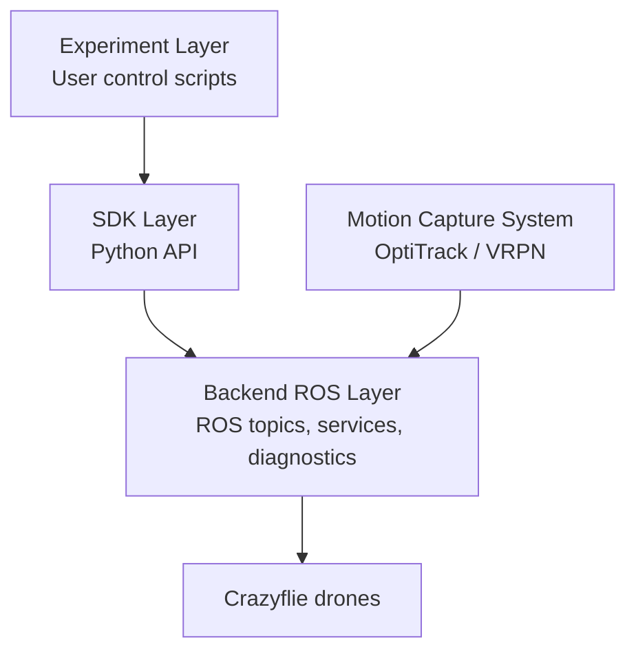
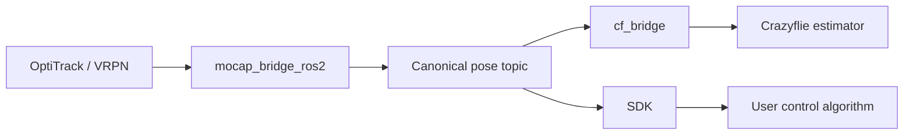
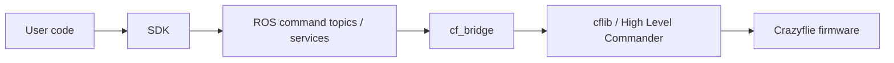

# OptiSwarmCF

A modular framework for controlling **Crazyflie swarms** using a **ROS 2 backend** and a clean **Python SDK**.

OptiSwarmCF is designed for motion-capture-based robotics experiments where one or more Crazyflie drones are controlled through a layered architecture. The backend handles hardware communication, tracking integration, estimator updates, command execution, and diagnostics. The SDK provides a simpler Python interface for writing control loops and multi-agent experiments.


<p align="center">
  <video src="[https://github.com/user/repo/assets/123456/demo.mp4](https://github.com/user-attachments/assets/a7129c12-d432-43e4-aef6-7861dd379355)" controls width="700"></video>
</p>

> **Status**  
> OptiSwarmCF is an experimental research framework. The current architecture is usable as a baseline for real tests, but higher-level tools such as a complete SDK orchestrator, backend CLI, and formal command-state machine are still under development.

---

## Table of Contents

- [What is OptiSwarmCF?](#what-is-optiswarmcf)
- [Who is this framework for?](#who-is-this-framework-for)
- [What problem does it solve?](#what-problem-does-it-solve)
- [How is the project structured?](#how-is-the-project-structured)
- [How is the system organized?](#how-is-the-system-organized)
- [How does data flow through the framework?](#how-does-data-flow-through-the-framework)
- [How are commands sent to the drones?](#how-are-commands-sent-to-the-drones)
- [What is the canonical pose contract?](#what-is-the-canonical-pose-contract)
- [What are the main ROS interfaces?](#what-are-the-main-ros-interfaces)
- [What does the backend do?](#what-does-the-backend-do)
- [What does the SDK do?](#what-does-the-sdk-do)
- [What are the core SDK components?](#what-are-the-core-sdk-components)
- [What are the requirements?](#what-are-the-requirements)
- [How do I build the backend?](#how-do-i-build-the-backend)
- [How do I configure the system?](#how-do-i-configure-the-system)
- [How do I run an experiment?](#how-do-i-run-an-experiment)
- [What does a minimal SDK script look like?](#what-does-a-minimal-sdk-script-look-like)
- [How are logging and diagnostics handled?](#how-are-logging-and-diagnostics-handled)
- [How do I troubleshoot common issues?](#how-do-i-troubleshoot-common-issues)
- [How should the system be shut down?](#how-should-the-system-be-shut-down)
- [What are the current limitations?](#what-are-the-current-limitations)
- [What is planned next?](#what-is-planned-next)
- [What is the recommended development workflow?](#what-is-the-recommended-development-workflow)
- [How should I cite or describe the project?](#how-should-i-cite-or-describe-the-project)

---

## What is OptiSwarmCF?

OptiSwarmCF is a ROS 2 and Python-based software stack for controlling one or more Crazyflie drones using an external motion-capture system, such as OptiTrack, and Crazyflie communication through `cflib` and Crazyradio.

The framework is split into two main components:

1. a **ROS 2 backend**, responsible for hardware-facing operations;
2. a **Python SDK**, responsible for user-facing experiment scripting.

The main design goal is to let the user focus on control logic, trajectory tracking, and swarm coordination, while the backend manages ROS topics, services, Crazyflie communication, estimator updates, and diagnostics.

---

## Who is this framework for?

OptiSwarmCF is intended for:

- students working on experimental robotics projects;
- researchers developing feedback-control or trajectory-tracking algorithms;
- developers testing multi-agent coordination strategies;
- users who need a Python interface over a ROS 2 and Crazyflie-based experimental setup.

Typical use cases include:

- single-drone position control;
- trajectory tracking;
- swarm coordination;
- formation control;
- rendezvous and consensus experiments;
- motion-capture-based closed-loop tests.

---

## What problem does it solve?

Working with physical Crazyflie drones in a multi-agent setup usually requires several separate components:

- motion-capture acquisition;
- coordinate-frame normalization;
- ROS topic and service management;
- Crazyradio and `cflib` communication;
- external position updates for the Crazyflie estimator;
- takeoff, landing, and EKF reset procedures;
- repeated execution of experimental scripts.

OptiSwarmCF reduces this complexity by separating responsibilities clearly. The backend is responsible for stable hardware interaction, while the SDK provides high-level Python abstractions for experiments.

---

## How is the project structured?

```text
optiswarmcf/
├── backend_ros2/      # ROS 2 colcon workspace
│   └── src/
│       ├── mocap_bridge_ros2/
│       └── cf_bridge/
├── scripts/           # Shell scripts and launch helpers
├── sdk/               # Python SDK package
│   └── src/optiswarmcf/
├── examples/          # Example controllers and experiments
└── README.md
```

The repository contains both the backend and the SDK because the two parts are designed to work together, but they keep different responsibilities.

---

## How is the system organized?

The architecture is divided into three conceptual layers.



### Backend ROS Layer

The backend communicates directly with the infrastructure and hardware. It receives motion-capture data, normalizes poses, connects to Crazyflies, forwards external position updates, exposes command interfaces, and publishes diagnostics.

### SDK Layer

The SDK is a Python client library built on top of the backend ROS API. It hides publishers, service clients, executor handling, and topic-name boilerplate behind objects such as `RosContext`, `OptiTrack`, `CrazyflieAgent`, and `Swarm`.

### Experiment Layer

This is where the user writes the actual control logic, trajectory generation, swarm behavior, and test scripts.

---

## How does data flow through the framework?

The state-estimation flow is:



Step by step:

1. The tracking system publishes raw rigid-body poses, typically through VRPN ROS topics.
2. `mocap_bridge_ros2` receives the raw motion-capture pose.
3. `mocap_bridge_ros2` converts it into a canonical `PoseStamped` representation.
4. `cf_bridge` consumes the canonical pose and forwards it to the Crazyflie estimator.
5. The SDK reads the same canonical state and exposes it to user code.
6. The user algorithm computes the next command.

---

## How are commands sent to the drones?

The command flow is:



The current command model is based on:

- topic-driven position commands;
- service-driven discrete actions.

Typical commands include:

- absolute position commands;
- relative position commands;
- takeoff;
- land;
- EKF reset.

When a target position is sent without an explicit duration, the backend estimates the motion duration using the configured nominal speed, minimum duration limits, and safety margins.

---

## What is the canonical pose contract?

The canonical pose contract is one of the main architectural rules of OptiSwarmCF.

> Pose normalization must happen once, and only once, inside the motion-capture bridge.

After `mocap_bridge_ros2` produces the canonical pose:

- `cf_bridge` must treat it as final;
- the SDK must treat it as final;
- user code must operate in the canonical frame;
- coordinate corrections should not be duplicated elsewhere.

This rule avoids hidden frame transformations and inconsistent coordinate fixes across the stack.

A typical canonical pose topic follows this convention:

```text
/mocap/<drone_id>/pose
```

For example:

```text
/mocap/cf1/pose
/mocap/cf2/pose
/mocap/cf3/pose
```

---

## What are the main ROS interfaces?

The backend exposes a minimal ROS API built around topics, services, and diagnostics.

### Motion-capture topics

Canonical pose topics are produced by `mocap_bridge_ros2` and consumed by both `cf_bridge` and the SDK.

```text
/mocap/<drone_id>/pose
```

Message type:

```text
geometry_msgs/msg/PoseStamped
```

### Command topics

Absolute position command:

```text
/<ns>/cmd_pos
```

Message type:

```text
geometry_msgs/msg/PoseStamped
```

Relative position command:

```text
/<ns>/cmd_pos_relative
```

Message type:

```text
geometry_msgs/msg/Twist
```

### Services

```text
/<ns>/takeoff
/<ns>/land
/<ns>/ekf_reset
```

Service type:

```text
std_srvs/srv/Trigger
```

### Diagnostics

```text
/<ns>/diag
```

Message type:

```text
diagnostic_msgs/msg/DiagnosticArray
```

---

## What does the backend do?

The backend is the execution layer between real hardware and user-facing control code.

It consists mainly of the following components.

### VRPN client

The VRPN client connects to OptiTrack/Motive and publishes raw ROS topics containing the rigid-body poses.

### `mocap_bridge_ros2`

The motion-capture bridge normalizes VRPN topics and republishes canonical pose topics:

```text
/mocap/<drone_id>/pose
```

Its responsibilities include:

- selecting the canonical frame id;
- applying the configured axis convention;
- adapting source topics to the canonical topic structure;
- keeping coordinate normalization centralized.

### `cf_bridge`

The Crazyflie bridge interfaces with the physical drones through `cflib` and Crazyradio.

Its responsibilities include:

- opening and managing Crazyflie radio links;
- setting Crazyflie firmware parameters;
- subscribing to canonical motion-capture topics;
- sending external position updates to the Crazyflie estimator;
- exposing command topics and services;
- executing high-level Crazyflie commands;
- checking pose availability;
- rejecting invalid or unsafe pose data;
- publishing machine-readable diagnostics.

The backend should **not** contain experiment logic, swarm algorithms, or user-specific control policies.

---

## What does the SDK do?

The SDK is the user-facing Python layer.

It is not a replacement for the backend. Instead, it is a thin client library that simplifies access to the backend ROS API.

The SDK hides:

- ROS publisher creation;
- ROS service-client calls;
- executor handling inside the SDK process;
- topic naming boilerplate;
- low-level backend wiring.

The SDK exposes:

- a ROS context/session object;
- a motion-capture client;
- a single-drone agent abstraction;
- a swarm abstraction;
- structured pose and observation models.

> **Important**  
> The SDK creates its own ROS node/context for communication, but it does **not** start the backend nodes. The backend must already be running before the SDK-based experiment script is executed.

---

## What are the core SDK components?

### `RosContext`

Owns the ROS runtime used by the SDK. It initializes ROS when needed, creates a node, starts an executor in a background thread, checks executor health, and shuts down cleanly.

### `OptiTrack`

Subscribes to canonical motion-capture pose topics and provides convenient methods to access drone poses and wait until tracking data is available.

### `CrazyflieAgent`

Represents one logical Crazyflie from the user point of view. It wraps the command topics and services exposed by `cf_bridge`.

### `Swarm`

Groups multiple `CrazyflieAgent` objects and provides operations that naturally apply to several drones.

### `Pose3D` and `Observation`

Small immutable data models used to expose structured state to user code.

---

## What are the requirements?

Install ROS 2 tools:

```bash
sudo apt update
sudo apt install -y python3-colcon-common-extensions python3-rosdep
```

Initialize `rosdep`:

```bash
sudo rosdep init
rosdep update
```

Install the Crazyflie Python library:

```bash
python3 -m pip install --user cflib
```

Depending on your setup, you may also need:

- a working ROS 2 installation;
- access permissions for Crazyradio USB devices;
- OptiTrack/Motive running on the tracking machine;
- VRPN ROS 2 support;
- Python dependencies required by the SDK package.

---

## How do I build the backend?

```bash
cd backend_ros2

rosdep install --from-paths src --ignore-src -r -y --skip-keys ament_python

source /opt/ros/$ROS_DISTRO/setup.bash
colcon build --symlink-install
source install/setup.bash
```

Verify that the backend packages are visible:

```bash
ros2 pkg list | grep cf_bridge
ros2 pkg list | grep mocap_bridge_ros2
```

---

## How do I configure the system?

The project uses configuration files to describe stable backend behavior.

Configuration should describe:

- drone identities;
- Crazyflie radio URIs;
- ROS namespaces;
- motion-capture source topics;
- canonical frame settings;
- timing defaults;
- filtering and validation thresholds;
- diagnostics cadence.

Configuration files should **not** encode experiment-specific control logic.

### `mocap_bridge_ros2` configuration: `mocap.yaml`

This file defines the mapping from VRPN topics to canonical motion-capture topics.

```yaml
frame_id: map
topic_prefix: /mocap
axis_mode: identity

sources:
  cf1:
    topic: "/VRPN_TOPIC_CF1"
    type: "pose_stamped"
```

The output topic is:

```text
/mocap/cf1/pose
```

### `cf_bridge` configuration: `cf_bridge.yaml`

This file defines the Crazyflie drones and the backend behavior.

```yaml
drones:
  - id: "cf1"
    uri: "radio://0/90/2M/E7E7E7E702"
    ns: "/cf1"
    mocap_topic: "/mocap/cf1/pose"

with_orient: false
start_hl: true
hl_only: true

estimator: 2
controller: 2
en_high_level: true

speed: 0.30
min_abs_duration: 1.0
min_rel_duration: 0.5
abs_duration_margin: 0.5
rel_duration_margin: 0.3
fallback_abs_duration: 1.5

diag_period_sec: 0.5
pose_stale_after_sec: 0.5
extpos_max_rate_hz: 50.0
max_pose_jump_m: 0.25
min_valid_z_m: -0.02

cache_dir: ./.cf_cache
```

---

## How do I run an experiment?

The framework is designed to be executed through a launcher script that starts the backend and runs the user controller.

### Recommended execution

```bash
./scripts/run_experiment.sh examples/minimal_controller.py
```

A typical experiment follows this sequence:

1. Start the motion-capture source.
2. Start the VRPN client.
3. Start `mocap_bridge_ros2` to normalize tracking data.
4. Start `cf_bridge` to connect to the Crazyflies.
5. Launch a Python script using the SDK.
6. Wait until poses are available.
7. Reset the estimator if required.
8. Execute the control algorithm.
9. Land the drones and shut down cleanly.

The backend can remain active while multiple experiments are executed sequentially, provided that each experiment leaves the system in a safe state.

---

## What does a minimal SDK script look like?

```python
from optiswarmcf import (
    RosContext,
    OptiTrack,
    OptiTrackConfig,
    CrazyflieAgentConfig,
    Swarm,
    SwarmConfig,
)


def main() -> None:
    with RosContext() as ctx:
        mocap = OptiTrack(
            ctx,
            OptiTrackConfig(
                pose_topics={
                    "cf1": "/mocap/cf1/pose",
                    "cf2": "/mocap/cf2/pose",
                }
            ),
        )

        swarm = Swarm(
            ctx,
            SwarmConfig(
                mocap_pose_topics={
                    "cf1": "/mocap/cf1/pose",
                    "cf2": "/mocap/cf2/pose",
                },
                agents={
                    "cf1": CrazyflieAgentConfig.from_drone_id("cf1"),
                    "cf2": CrazyflieAgentConfig.from_drone_id("cf2"),
                },
            ),
        )

        if not swarm.wait_all_ready(mocap, tmax=10.0):
            raise RuntimeError("Not all drones received a valid pose")

        swarm.takeoff_all(timeout_sec=5.0)

        swarm.go_to_abs("cf1", 0.0, 0.0, 0.7)
        swarm.go_to_abs("cf2", 0.5, 0.0, 0.7)

        swarm.land_all(timeout_sec=5.0)


if __name__ == "__main__":
    main()
```

---

## How are logging and diagnostics handled?

OptiSwarmCF distinguishes between logs and diagnostics.

### Logs

Logs are used for human-readable runtime events, warnings, and failures.

Examples:

- Crazyflie connection status;
- invalid pose warnings;
- service-call failures;
- command execution errors.

### Diagnostics

Diagnostics are structured periodic status messages intended for monitoring and machine-side introspection.

They can report information such as:

- connection state;
- pose availability;
- pose age;
- pose rate;
- readiness state;
- estimator/controller configuration;
- last command.

This distinction avoids overloading the log stream and enables future dashboards, CLI tools, and health-check utilities.

---

## How do I troubleshoot common issues?

### No topics visible

Check whether ROS 2 nodes are running and whether the daemon is active:

```bash
ros2 node list
ros2 daemon status
```

### No `/mocap/...` topics

Check that:

- OptiTrack/Motive is running;
- the VRPN client is publishing topics;
- `mocap.yaml` maps the correct source topics;
- `topic_prefix` is set consistently with the SDK and `cf_bridge` configuration.

### Drone not responding

Check that:

- Crazyradio is connected;
- the Crazyflie URI is correct;
- the Crazyflie is powered and reachable;
- `cf_bridge.yaml` uses the correct namespace and motion-capture topic;
- the backend has received at least one valid pose before takeoff.

Test that `cflib` is installed:

```bash
python3 -c "import cflib"
```

### EKF reset fails or drone is not ready

Check that:

- a valid motion-capture pose is being received;
- the pose topic name matches the one configured in `cf_bridge.yaml`;
- the pose is not stale;
- the drone is connected before calling `/ekf_reset`.

### Rebuild backend

From inside `backend_ros2`:

```bash
rm -rf build install log
colcon build --symlink-install
source install/setup.bash
```

---

## How should the system be shut down?

Stop the system in this order:

1. `cf_bridge`
2. `mocap_bridge_ros2`
3. VRPN client
4. OptiTrack/Motive, if needed

This order helps avoid leaving the drones without a valid backend while the tracking system is still active.

---

## What are the current limitations?

The current architecture is functional but not final.

Known limitations include:

- the SDK still requires manual construction of context, motion-capture client, and swarm objects;
- a high-level experiment/session entry point is not yet implemented;
- backend command arbitration is still minimal;
- a formal command-state machine is not yet available;
- diagnostics are available at the backend level, while SDK-side diagnostics tooling is still limited;
- advanced low-level command streaming modes are not yet part of the stable public API.

These limitations are architectural, not accidental: the current version prioritizes a clear separation of responsibilities before adding more automation.

---

## What is planned next?

Planned improvements include the following.

### SDK orchestrator

A higher-level SDK object should automatically build and connect:

- `RosContext`;
- `OptiTrack`;
- `Swarm`.

This would reduce boilerplate and make experiment scripts cleaner.

### Backend CLI

A future CLI could:

- validate configuration files;
- select hardware profiles;
- launch backend nodes;
- run health checks;
- inspect diagnostics.

### Command-state model

The Crazyflie backend should evolve toward a minimal internal command-state machine to improve command arbitration and avoid unsafe mixing of command modes.

### Advanced command modes

Future versions may support lower-level command streaming while keeping it clearly separated from high-level motion commands.

### Multi-sensor extension

The architecture is designed to support additional state sources and adapters without changing the SDK-facing control API.

---

## What is the recommended development workflow?

For the current version:

1. Configure the motion-capture and Crazyflie backend files.
2. Start the backend through ROS launch files or scripts.
3. Run an SDK-based Python experiment.
4. Check pose readiness before sending commands.
5. Keep frame transformations centralized in `mocap_bridge_ros2`.
6. Keep experiment logic out of the backend.
7. Use diagnostics to verify backend health.
8. Land and reset the system cleanly after each test.

A more polished future workflow should look like:

1. start or configure the backend through a CLI;
2. launch an experiment through a high-level SDK entry point;
3. inspect system health through diagnostics tools;
4. repeat experiments without restarting the backend.

---

## How should I cite or describe the project?

A concise description of the project is:

> OptiSwarmCF is a ROS 2 and Python-based framework for motion-capture-driven Crazyflie experiments, designed to separate hardware interaction, ROS backend infrastructure, and user-facing multi-agent control logic.

For thesis or academic writing, the key architectural idea is the separation between:

- the motion-capture backend;
- the Crazyflie backend;
- the user-facing SDK;
- the experiment scripts.

This separation allows the researcher to focus on control and coordination algorithms while the backend handles hardware communication, pose normalization, command execution, and diagnostics.
